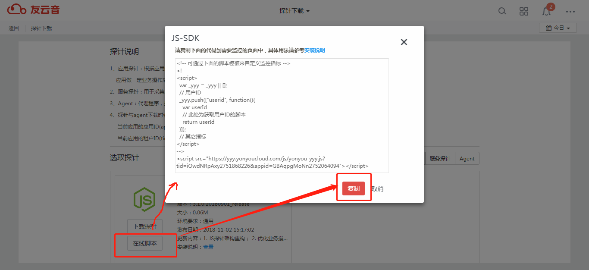

# 友云音Browser探针安装说明

友云音Browser使用JavaScript代码（JS SDK：`yonyou-yyy.js`，又称为`探针`）监控您的网页应用。每个探针都关联着系统分配给您的租户ID（`tid`）和应用ID（`appid`），最终您将在对应的租户应用中看到我们的统计分析数据。
本文介绍如何将SDK安装到您的网站中。

## 获取SDK

1. 登录友云音，进入“应用管理”界面。


2. 选择需要监控的Browser类型应用，点击下载图标进入SDK下载界面。


3. 选择“应用探针”节点，点击“下载探针”直接下载文件，或者使用“在线脚本”从我们的服务器动态加载：


4. 点击“下载探针”直接下载文件


_注：下载的文件为zip格式的压缩文件，需要解压后使用。_

5. 使用“在线脚本”从我们的服务器动态加载




## 安装SDK

`安装SDK`指通过一定的方式，使得加载网站页面的时候，可以引入探针文件。探针文件可以通过`直接下载`或`在线安装`方式获取。
* `直接下载`指的是从友云音服务器将探针文件下载到本地，然后将其部署到您的应用服务器，访问网站时浏览器将从您的应用服务器加载探针；
* `在线安装`指的是每次打开网站时，浏览器直接从友云音服务器获取探针。

### NC portal应用

 将下载的压缩文件解压后，复制yonyou-yyy.js到 {nchome}/hotwebs/portal目录下。

 > NC portal应用只能选择`直接下载`的方式进行安装

### 其它WEB应用

可根据需要选择`直接下载`或者`在线安装`任一方式。代码安装过程中需要注意以下几点：

* 代码的安装位置要正确，请将代码段添加在标签&lt;head>标记中尽量靠前的位置，但要放在某些对位置比较敏感的&lt;meta>标签之后（例如`X-UA-Compatible`或`charset`信息）。
*建议添加到`公共页面`头部，这样可以减少工作量。如果没有公共页面，也可以考虑添加到公共JS中，但这样可能会造成数据采集不完整。*
* 一个页面中不要重复添加相同的代码，统计有去重规则，一般不会重复计算。一段代码生效后，另外一段代码就会废弃，但建议只添加一段代码。
* 使用`在线脚本`的方式安装时，请不要删除src值中的`tid`和`appid`参数值，否则SDK将不可用

    如果是直接下载的文件，需要解压后放到某路径下（“{your/path/}”），再执行以下步骤。

> 正确的`tid`和`appid`是探针正常运行的前提条件。
> 直接下载的探针文件中已包含了这两个字段的值，所以在安装代码段中不必再次指定。
> **再次强调**：在线安装时，请不要修改或删除`src`中预设的`tid`和`appid`参数值。

#### 异步方式
```
<script>
    var _yyy = _yyy || [];
    (function() {
        _yyy.push([metric1, literal]);
        _yyy.push([metric2, function]);
        // 可添加更多监控项或配置项
        // ...

        // 创建script节点以加载探针
        var s = document.createElement("script");
        // 指定src属性：下面的（1）和（2）根据情况选择其中一种
        // （1）直接下载到本地安装，假定JS探针的部署路径为“{your/path/}”
        s.src = "{your/path}/yonyou-yyy.js";
        // （2）使用“在线脚本”的方式安装，需要指定tid和appid的值（下载页面已预设，不要删除或修改，否则SDK将不可用！）
        // 也可以将src属性值中的“https://yyy.yonyoucloud.com”替换为{your/path}，从本地加载
        s.src = "https://yyy.yonyoucloud.com/yonyou-yyy.js?tid=***&appid=***";
        var t = document.getElementsByTagName("script")[0];
        t.parentNode.insertBefore(s, t);
    })();
</script>
```
如果是通过js脚本加载，请将上面代码段中`<script>`标签内部的文本复制到相应的js中。

#### 同步方式

虽然异步方式可以小幅提升页面加载性能，但仍然推荐以同步方式加载探针，因为我们对浏览器内置的一些API作了包装，提前执行脚本可提高监控准确度。不过，如果应用依赖于某些框架提供的API，例如cordova.js的HTTP请求API，则在引入框架脚本之后再添加本探针的安装代码。

```
<script>
    var _yyy = _yyy || [];
    (function() {
        _yyy.push([metric1, literal]);
        _yyy.push([metric2, function]);
        // 可添加更多监控项或配置项
        // ...
    })();
</script>
<!-- 如果是直接下载并安装到内部环境的探针，需要将下面src属性值中的“https://yyy.yonyoucloud.com”替换为“{your/path/}”-->
<!-- 如果使用“在线脚本”的方式，则不要删除src值中的“tid”和“appid”参数，否则SDK将不可用！-->
<script src="https://yyy.yonyoucloud.com/yonyou-yyy.js?tid=***&appid=***"></script>
```

## 自定义监控维度

我们提供自定义监控指标的API接口，方便用户从多种维度进行分析。

以自定义监控用户为例，示例代码如下：
```用户ID为直接量
<script>
    var _yyy = _yyy || [];
    (function() {
        _yyy.push(['userid', {{USER_ID}}]);
        var s = document.createElement("script");
        s.src = "https://yyy.yonyoucloud.com/yonyou-yyy.js?tid=***&appid=***";
        var t = document.getElementsByTagName("script")[0];
        t.parentNode.insertBefore(s, t);
    })();
</script>
```
{{USER_ID}}可以以任何模板语法或js语法获取用户ID信息，例如JSP语法：
```
_yyy.push(['userid', <%=user%>]);
```
也可以是一个回调函数。例如：

```用户ID通过回调函数获取
_yyy.push(['userid', function(){
    var userid;
    // 获取用户ID的操作
    return userid;
}]);
```

## 附:可配置的指标

自定义的指标通过全局变量“_yyy”访问，运行时通过回调方式动态获取。回调可以为直接量，也可以是函数。
“_yyy”是一个二维数组变量，使用方法如下：
```
_yyy.push([metric1, literal]);
_yyy.push([metric2, function]);
...
```
示例内容可参考上文第2小节（“需要自定义监控指标项时的引入方式”）。

### **系统内置支持的指标列表**

|**字段**|**含义**|
|--------|--------|
|userid|用户ID。当使用友户通登录时，该字段为友户通用户主键。|
|username|用户名称|
|org_code|组织机构代码|
|org_name|组织机构名称|
|dept_code|部门代码|
|dept_name|部门名称|
|domaincode|领域代码|
|domainname|领域名称|
|modulecode|模块编码|
|modulename|模块名称|
|menugrpcode|应用分类编码|
|menugrpname|应用分类名称|
|menucode|应用编码|
|menuname|应用名称|
|def*n*|用户自定义的指标，最多支持20个，其中*n*为数字1~20|
